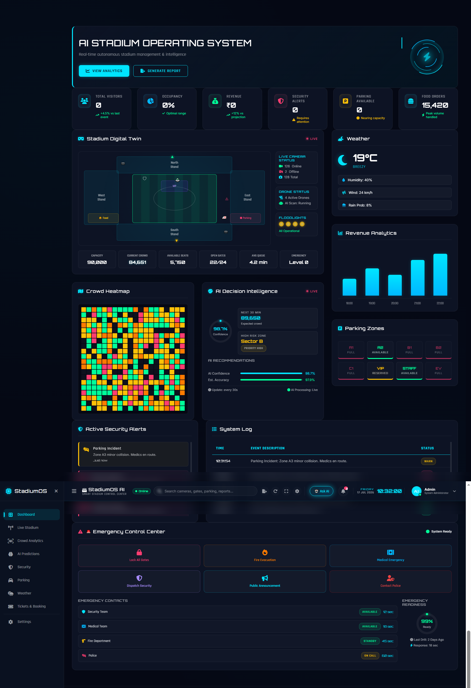

<div align="center">

# 🏟️ StadiumOS AI

### AI-Powered Smart Stadium Operating System

*Transforming Stadium Operations with Artificial Intelligence, Real-Time Analytics, and Intelligent Automation.*


---

### 🚀 Intelligent Stadium Management Dashboard

**Real-Time Monitoring • Crowd Intelligence • Security Analytics • Smart Parking • Ticket Management • Weather Intelligence**

</div>

---

# 📖 Overview

**StadiumOS AI** is an AI-powered Smart Stadium Management System that helps monitor and manage stadium operations from a single intelligent dashboard.

The project demonstrates how modern web technologies and backend APIs can be used to monitor visitors, crowd movement, parking, ticketing, security alerts, weather conditions, and stadium analytics through a clean, responsive interface.

---

# ✨ Features

## 📊 AI Dashboard

- Live Stadium Overview
- Visitor Statistics
- Revenue Analytics
- Occupancy Monitoring
- Operational KPIs
- Interactive Dashboard

---

## 👥 Crowd Intelligence

- Live Crowd Monitoring
- Entry & Exit Analytics
- Crowd Density Tracking
- Attendance Statistics
- Zone Occupancy

---

## 🛡 Security Center

- Security Dashboard
- Incident Monitoring
- Threat Notifications
- Activity Timeline
- Alert Management

---

## 🚗 Smart Parking

- Parking Availability
- Zone Management
- VIP Parking
- Vehicle Distribution
- Capacity Monitoring

---

## 🎟 Smart Ticketing

- Seat Availability
- VIP Booking
- Ticket Dashboard
- Seating Visualization

---

## 🌦 Weather Intelligence

- Live Weather
- Hourly Forecast
- Weekly Forecast
- Rain Probability
- Wind Monitoring

---

# 🧠 AI Concepts Demonstrated

- AI Dashboard
- Predictive Analytics
- Crowd Intelligence
- Decision Support Interface
- Smart Monitoring
- Real-Time Data Visualization
- Operational Analytics

---

# 🖥 User Interface

- Modern Dashboard
- Glassmorphism UI
- Responsive Design
- Interactive Cards
- Live Status Indicators
- Smooth Animations
- Professional Admin Interface

---

# 🛠 Tech Stack

| Technology | Purpose |
|------------|----------|
| HTML5 | Frontend Structure |
| CSS3 | Styling |
| JavaScript (ES6) | Frontend Logic |
| Node.js | Runtime |
| Express.js | Backend APIs |
| Jest | Backend Testing |
| Supertest | API Testing |
| GitHub Actions | Continuous Integration |

---

# 📂 Project Structure

```text
stadium-os-ai
│
├── backend
│   ├── tests
│   ├── package.json
│   └── server.js
│
├── css
├── js
├── .github
│   └── workflows
│       └── test.yml
│
├── index.html
├── package.json
├── README.md
├── image.png
├── image2.png
├── image3.png
└── image4.png
```

---

# 🚀 Installation

Clone the repository

```bash
git clone https://github.com/nensi25/stadium-os-ai.git
```

Go to the project

```bash
cd stadium-os-ai
```

Install backend dependencies

```bash
cd backend
npm install
```

Run backend

```bash
npm start
```

Run backend tests

```bash
npm test
```

---

# ✅ Automated Testing

This project includes automated backend API testing using:

- Jest
- Supertest
- GitHub Actions

Every push to the **main** branch automatically runs all backend tests.

---

# 📸 Project Screenshots

## 🏠 AI Dashboard



---

## 👥 Crowd Intelligence


---

## 🛡 Security Command Center


---

## 🚗 Smart Parking & Ticket Management


---

# 💡 Future Scope

- AI Chat Assistant
- Face Recognition Entry
- Computer Vision Crowd Detection
- IoT Sensor Integration
- Digital Twin Stadium
- Mobile Application
- Predictive Maintenance
- Emergency Alert Automation
- Cloud Deployment

---

# 🎯 Use Cases

- Cricket Stadiums
- Football Arenas
- Sports Complexes
- Concert Venues
- Convention Centers
- Smart Cities
- Public Events
- Exhibition Halls

---

# 📈 Project Highlights

✅ Responsive Dashboard

✅ AI-inspired Interface

✅ Express.js Backend

✅ REST APIs

✅ Automated Testing

✅ GitHub Actions CI

✅ Smart Parking

✅ Ticket Management

✅ Security Dashboard

✅ Weather Monitoring

---

# 👩‍💻 Developer

## Nensi Gohel

**B.Tech Computer Engineering**

### Connect With Me

🔗 GitHub: https://github.com/nensi25

💼 LinkedIn: https://www.linkedin.com/in/nensi-gohel-765935328/

---

# 🤝 Contributing

Contributions, suggestions, and improvements are always welcome.

Feel free to fork this repository and submit a Pull Request.

---

# ⭐ Support

If you found this project helpful,

⭐ Star this repository to support future improvements.

---

<div align="center">

## 🏟️ StadiumOS AI

### Building the Future of Intelligent Stadium Management

Made with ❤️ by **Nensi Gohel**

</div>
